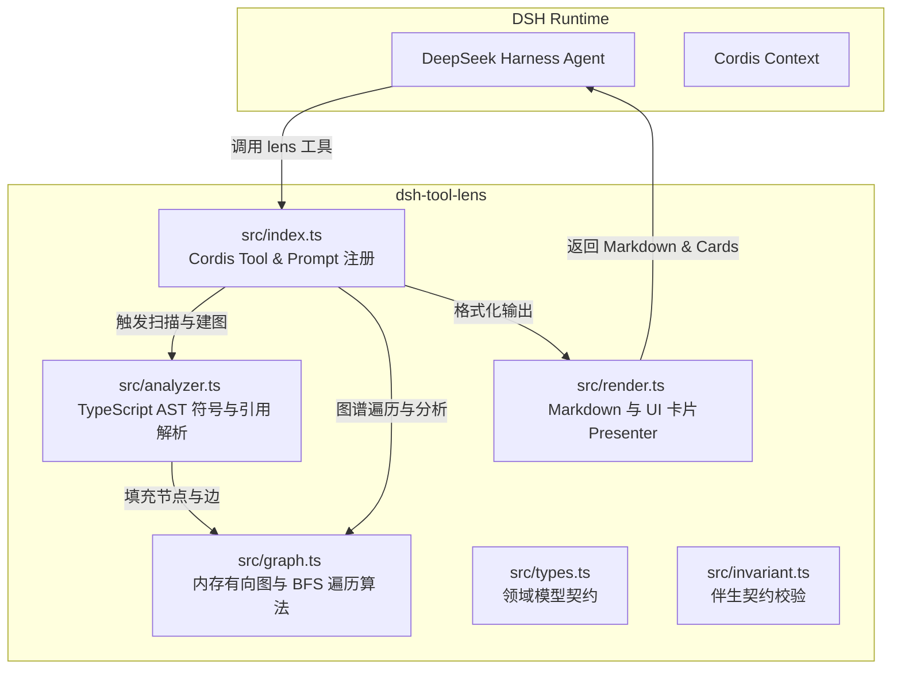
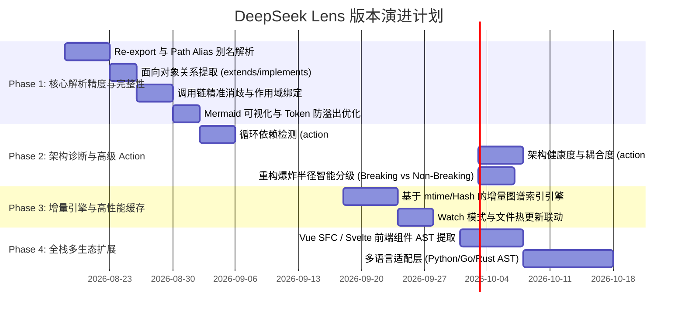

# DeepSeek Lens (`@trench-xinxin/dsh-tool-lens`) 需求分析与迭代规划文档

> **版本**：v1.0.0-planning  
> **状态**：Ready for Review  
> **制定角色**：资深前端架构师 & 代码质量检查官  
> **适用基座**：DeepSeek Harness (Cordis 微内核架构)

---

## 1. 项目现状与全景审计 (Current State Audit)

### 1.1 项目定位与核心价值
**DeepSeek Lens** 是专为 **DeepSeek Harness** 打造的高性能、确定性 AST 代码图谱与拓扑分析插件。它弥补了大模型在大型代码库中“代码阅读盲目”、“全局拓扑模糊”、“重构破坏面预估不准”的固有短板，为智能体赋予确定性的符号链路追踪与依赖感知能力。

### 1.2 现有架构与模块职责划分



### 1.3 现有实现亮点与能力基线 (v0.1.2)
1. **纯 AST 静态解析**：基于 TypeScript Compiler API 的 `ts.createSourceFile`，不依赖笨重的 Full-TypeChecker，建图性能极高。
2. **三类核心动作已就绪**：
   - `dependencies`：模块级依赖引用拓扑。
   - `call_graph`：函数/方法级调用链路（支持类成员方法、普通函数、箭头函数）。
   - `impact`：重构爆炸半径逆向分析（Inbound 依赖传播）。
3. **模糊搜索与短名解析**：支持类方法短名匹配（如 `analyzeSourceCode` 自动命中 `CodeAnalyzer.analyzeSourceCode`）与路径后缀匹配。
4. **零配置 CLI 体验**：提供 `bin/dsh-lens.js`，支持 `npx @trench-xinxin/dsh-tool-lens` 一键拉起预载 Lens 的 Web 界面。

---

## 2. 核心痛点与需求矩阵 (Gaps & Pain Points)

经过全面代码审查与深度调用路径分析，当前版本存在以下维度的问题与演进需求：

| 维度 | 序号 | 痛点现象 / 现有局限 | 影响级别 | 根因分析 |
| :--- | :--- | :--- | :--- | :--- |
| **解析精度** | GAP-01 | **丢失 Re-export 关系**：`export * from './types'` 或 `export { foo } from './foo'` 无法建立依赖和符号传递。 | **P0** | `analyzer.ts` 仅监听了 `ts.isImportDeclaration`，未处理 `ts.isExportDeclaration`。 |
| **解析精度** | GAP-02 | **路径别名与 Monorepo 包无法解析**：无法解析 `tsconfig.json` 的 `compilerOptions.paths`（如 `@/components/Btn`）和 workspace 本地包。 | **P0** | `resolveModulePath` 仅支持以 `.` 开头的相对路径，不支持绝对/别名解析。 |
| **解析精度** | GAP-03 | **面向对象关系缺失**：类型定义中声明了 `extends` 和 `implements`，但实际未做 AST 提取。 | **P1** | `ClassDeclaration` / `InterfaceDeclaration` 遍历时未提取 `heritageClauses`。 |
| **调用精度** | GAP-04 | **跨文件调用存在全局误判（False Positives）**：同名函数（如多文件都有 `render()`）在降级全局搜索时可能误连非当前导入模块的函数。 | **P1** | `linkAllCalls` 第三阶段使用全局符号搜索作为 fallback，缺乏导入作用域消歧。 |
| **性能效率** | GAP-05 | **无缓存全量冷扫描**：大模型每次触发 `execute` 都会重新扫盘解析整个 workspace。 | **P0** | 每次调用均 `new CodeAnalyzer()` 并重新 `indexDirectory`，无 mtime/哈希缓存。 |
| **大模型体验** | GAP-06 | **大型图谱 Token 易溢出**：节点过多时，直接全量打印 Markdown 消耗过多大模型 Context。 | **P1** | 缺少 Compact 紧凑模式、重要度裁剪（Top-K 枢纽筛选）与可视化 Mermaid 图输出。 |
| **架构诊断** | GAP-07 | **缺少高级架构分析能力**：缺乏循环依赖检测（Circular Dependency）与代码耦合度评估（Metrics）。 | **P1** | 当前动作仅有 `dependencies/call_graph/impact`，未封装环路检测与扇入扇出分析。 |
| **生态扩展** | GAP-08 | **不支持前端 SFC 组件**：无法识别 Vue (`.vue` script setup)、Svelte 等单文件组件。 | **P2** | 文件扩展名和解析器仅支持纯 JS/TS/TSX。 |

---

## 3. 迭代路线图与里程碑规划 (Roadmap)



---

## 4. 各阶段详细实施方案 (Detailed Implementation Specifications)

### Phase 1 (v0.2.0): 核心解析精度与完整性升级 (Precision & Completeness)

#### 1.1 模块重导出 (Re-export) 与导入别名补全
- **需求目标**：支持 `export * from './sub'`、`export { a, b as c } from './sub'` 以及 `import * as Foo from './foo'`。
- **技术设计**：
  - 在 `analyzer.ts` 的 `visitDefinitions` 中新增对 `ts.isExportDeclaration` 的处理，解析 `node.moduleSpecifier`。
  - 将 Re-export 作为 `imports` / `exports` 关系入图，并支持别名（Alias）符号映射。

#### 1.2 `tsconfig.json` 路径别名（Path Mapping）与 Monorepo Workspace 支持
- **需求目标**：自动读取工作区根目录及子目录中的 `tsconfig.json` / `jsconfig.json`，解析 `paths`（如 `@/*` -> `src/*`）。
- **技术设计**：
  - 在 `indexDirectory` 时检测并解析 `tsconfig.json` 的 `compilerOptions.baseUrl` 与 `paths` 字典。
  - 在 `resolveModulePath` 中增加别名模式匹配，优先通过 `paths` 命中实际物理文件。

#### 1.3 面向对象继承与实现关系提取 (`extends` / `implements`)
- **需求目标**：补齐 `types.ts` 中已定义的 `extends` 和 `implements` 关系。
- **技术设计**：
  - 扫描 `ts.ClassDeclaration` 与 `ts.InterfaceDeclaration` 的 `heritageClauses`。
  - 提取 `extends` 目标类/接口，创建 `relation: 'extends'` 边。
  - 提取 `implements` 目标接口，创建 `relation: 'implements'` 边。

#### 1.4 调用链消歧（Scope-Aware Call Resolution）
- **需求目标**：消除全局同名函数误判，按作用域优先级精准绑定。
- **调用解析四级阶梯策略**：
  1. **Tier 1 (Local)**：同文件内部作用域或当前类内方法。
  2. **Tier 2 (Explicit Import)**：当前文件通过 `import { func } from './target'` 显式导入的模块。
  3. **Tier 3 (Wildcard / Namespace Import)**：当前文件通过 `import * as pkg from './target'` 导入的模块。
  4. **Tier 4 (Discard / Low-Confidence Edge)**：如果仅是全局存在同名而没有直接导入关系，不创建虚假 `calls` 强边，或降级为可信度标记边。

#### 1.5 渲染引擎升级：Mermaid 拓扑图与防 Token 溢出
- **需求目标**：为人类和模型提供直观图谱预览，避免大图产生上万 Token。
- **技术设计**：
  - 当节点数 $\le 25$ 时，自动追加 `mermaid` 代码块：
    ```mermaid
    graph TD
      A[src/index.ts] -->|imports| B[src/analyzer.ts]
      B -->|calls| C[GraphStore.addNode]
    ```
  - 当节点数 $> 50$ 时，启动智能折叠：输出前 30 个核心节点，并展示 `... and X more nodes omitted for brevity`。

---

### Phase 2 (v0.3.0): 架构诊断与高级 Action 扩展 (Advanced Diagnostics)

#### 2.1 循环依赖检测 (`action: 'circular'`)
- **需求目标**：一键检测工作区内所有的循环引用链路（如 `A -> B -> C -> A`），防止运行时未初始化与内存泄露。
- **技术设计**：
  - 基于 Tarjan 算法或深度优先搜索（DFS 染色法，White-Gray-Black 算法）查找强连通分量（SCC）。
  - 返回环的完整闭合链路：`a.ts -> b.ts -> c.ts -> a.ts`。

#### 2.2 架构健康度与耦合度评估 (`action: 'metrics'`)
- **需求目标**：识别项目的核心枢纽节点、过载类（God Class）与高危不稳定模块。
- **关键度量指标**：
  - **扇入（Afferent Coupling, $Ca$）**：有多少外部模块依赖本模块（衡量责任度）。
  - **扇出（Efferent Coupling, $Ce$）**：本模块依赖了多少外部模块（衡量独立性）。
  - **不稳定度（Instability, $I = Ce / (Ca + Ce)$）**：评估代码易碎性。
  - **核心枢纽符号（Top Hubs）**：按 PageRank 或度中心性输出 Top 5 关键类/函数。

#### 2.3 重构影响面智能分级 (Blast Radius Tiers)
- **需求目标**：在 `impact` 动作中，将影响面细化为风险级别：
  - **P0 - Direct Breaking Risk**：直接修改导出的公共函数签名/接口，所有外部 Caller 均需修改。
  - **P1 - Internal Cascading Risk**：内部私有函数修改，仅影响同模块内的调用链路。
  - **P2 - Transitive Importers**：上游只做了类型引入或间接导入。

---

### Phase 3 (v0.4.0): 增量更新与高性能缓存体系 (Incremental Engine)

#### 3.1 基于 mtime / SHA-256 的增量解析引擎
- **需求目标**：二次查询实现毫秒级（< 20ms）响应，10 万行代码大型仓库无卡顿。
- **技术设计**：
  - 在内存或 `.dsh/lens-cache.json` 中持久化 `FileMeta { mtime, hash, symbols, imports, calls }`。
  - 触发查询时，仅对发生变更的文件重新生成 AST，并在 `GraphStore` 中针对该文件执行局部“删除旧边 -> 插入新边 -> 重新 Link”。

#### 3.2 文件变更 Watch 模式
- **技术设计**：
  - 接入 Node.js `fs.watch` 或集成 Cordis 事件总线，在开发者或 Agent 编辑文件后自动触发局部图更新。

---

### Phase 4 (v1.0.0): 多语言与前端生态全景 (Multi-Ecosystem & SFC)

#### 4.1 前端单文件组件（Vue SFC / Svelte）支持
- **需求目标**：支持解析 `.vue`（`<script setup lang="ts">`）与 `.svelte` 文件中的组件依赖与函数调用。
- **技术设计**：
  - 集成 `@vue/compiler-sfc` 轻量提取 `<script>` 块进行 TS AST 分析，并从 `<template>` 中提取组件标签依赖。

#### 4.2 多语言架构抽象与 LSP / Tree-sitter 集成
- **需求目标**：支持 Python (`.py`)、Go (`.go`)、Rust (`.rs`) 等后端代码图谱。
- **技术设计**：
  - 抽象统一的 `LanguageDriver` 接口。
  - TypeScript 使用原生 TS Compiler API，其他语言基于 Tree-sitter WASM 实现多语言统一 AST 提取。

---

## 5. 架构设计与重构规范 (Technical Architecture Design)

为了保障代码质量（符合资深前端架构师与代码质量标准），建议将 `src/` 进行分层重构解耦：

```
packages/lens/tool-lens/src/
├── core/
│   ├── graph.ts              # 核心图结构、Tarjan 强连通分量、BFS/DFS 算法
│   ├── types.ts              # 领域模型与契约
│   └── cache.ts              # 增量缓存与哈希管理 (Phase 3)
├── parsers/
│   ├── ts-parser.ts          # TypeScript/JavaScript AST 解析器
│   ├── config-parser.ts      # tsconfig.json 与 paths 别名解析器
│   └── sfc-parser.ts         # Vue/Svelte 单文件组件解析适配器 (Phase 4)
├── analytics/
│   ├── impact.ts             # 重构爆炸半径评估与分级
│   ├── circular.ts           # 循环依赖分析器 (Phase 2)
│   └── metrics.ts            # 扇入扇出与耦合度指标计算器 (Phase 2)
├── render/
│   ├── markdown.ts           # 大模型紧凑 Markdown 格式化
│   ├── mermaid.ts            # Mermaid 拓扑图生成器
│   └── presenter.ts          # DSH Web UI 卡片展示
├── index.ts                  # Cordis 插件入口、Schema 校验与 defineTool
└── invariant.ts              # Invariant 伴生插件
```

---

## 6. 质量保障与验收标准 (Quality Assurance & Acceptance Criteria)

### 6.1 测试覆盖率指标
- 单元测试代码覆盖率（Line / Branch / Function Coverage）保持在 **$\ge 95\%$**。
- 必须覆盖以下边界用例：
  1. 复杂的多层循环依赖（`A -> B -> C -> A`）。
  2. 混合使用了相对路径、`tsconfig` 别名路径与跨包引用的 Monorepo 项目。
  3. 含有类继承、抽象类方法重写与多接口实现的 OOP 代码库。
  4. 空目录、无效语法文件、超大单文件（> 10000 行）与二进制文件的容错处理。

### 6.2 性能 SLA 基准
- **冷启动全量扫描**：对于 1,000 个源文件（约 10 万行代码），全量建图耗时 $\le 1.2\text{s}$。
- **增量缓存查询**：单文件修改后，增量刷新耗时 $\le 30\text{ms}$。
- **内存占用**：1,000 个源文件的常驻内存图谱占用 $\le 50\text{MB}$。

---

## 7. 总结与行动项 (Action Items)

| 阶段 | 核心任务 | 状态 |
| :--- | :--- | :---: |
| **Phase 1 (v0.2.0)** | 补齐 Re-export、tsconfig paths 别名、extends/implements 关系、Mermaid 图渲染 | ✅ **已完成** |
| **Phase 2 (v0.3.0)** | 新增 circular 循环依赖检测、metrics 架构指标、impact 爆炸半径分级 | ✅ **已完成** |
| **Phase 3 (v0.4.0)** | 增量建图引擎与 mtime/SHA-256 缓存、Watch 模式 | ✅ **已完成** |
| **Phase 4 (v1.0.0)** | Vue SFC 支持、Svelte 支持与多语言 Driver 抽象层 | ✅ **已完成** |
